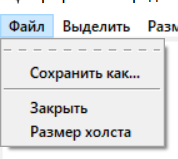
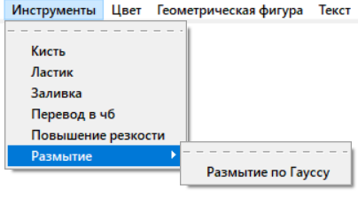

# Графический (растровый) редактор

## Гагарина Александра ФТ-103

Реализация графического растрового редактора на языке Python

### Файловая структура

* `main.py` - основной файл, который надо запускать
* `CanvasManager.py` - класс, отвечающий за управление холстом
* `DrawingTools.py` - класс, отвечающий за набор используемых инструментов
* `MainPaint.py` - класс, который всё связывает в единую программу
* `MenuBuilder.py` - класс, отвечающий за меню
* `SelectionManager.py` - вспомогательный класс для управления выделением

### Тесты

* файл `test_drawing_tools.py` содержит модульные тесты, покрывающие основные случаи

  

можно указать размеры файла и сохранить в удобном формате.
есть возможность указать свой размер

 
выбор инструментов и цвета

 

можно использовать готовую геометрическую фигуру или написать текст

работа со слоями. изначально слой 1. между ними можно переключаться

